# DFEC Robot

The DFEC Robot was created for the Department of Electrical and Computer Engineering (ECE) at the US Air Force Academy. It is used to teach ECE fundamentals in the major's introductory course. The robot's chassis is built using 3D printed parts. An Arduino Uno Rev3 microcontroller board and a custom designed power and motor controller Printed Circuit Board (PCB) are used to control the robot.

## Labs

Six labs guide the students from soldering the PCB and assembling the robot to using distance and line sensors to guide the robot through a maze.

[Robot PCB](Labs/0_robot_pcb/robot_pcb.pdf) - This lab guides students to solder and test their PCB.

[Robot Build](Labs/1_robot_build/robot_build.pdf) - This lab provides instructions to assemble the robot.

[Robot Motors](Labs/2_robot_motors/robot_motors.pdf) - This lab investigates how the Arduino uses Pulse Width Modulation to drive the robot's motors.

[Robot Drive](Labs/3_robot_drive/robot_drive.pdf) - This lab has students control the motors to drive in specified patterns.

[Robot Line Following](Labs/4_robot_linefollowing/robot_linefollowing.pdf) - This lab integrates the Pololu QTR-8RC Line Sensor Array to enable the robot to follow a black line.

[Robot Wall Following](Labs/5_robot_wallfollowing/robot_wallfollowing.pdf) - This lab integrates the Sharp GP2Y051SK0F 2-15 cm Analog Distance Sensor to enable the robot to follow walls.

[Robot Maze](Labs/6_robot_maze/robot_maze.pdf) - This lab is broken up into three parts: 1) follow a line through a maze; 2) follow a line through a maze and turn around and return to the start of the maze; and 3) navigate a walled maze towards a goal location.

## Libraries

There are two custom libraries used to control the robot. These libraries should be copied into library folder at `root/Documents/Arduino/libraries`.

[Motor](Labs/libraries/Motor/Motor.h) - This library provides functions to drive the robot using left and right PWM values (e.g., `Motor_Init()`, `Motor_Forward(int leftDuty, int rightDuty)`, and `Motor_Stop()`)

[QTR-8RC](Labs/libraries/QTR-8RC/QTR-8RC.h) - This library is adapted from the QTRSensors library to utilize the QTR-8RC Reflectance Sensor Array to determine how far the robot is off a line.

## Projects

There are several projects that incorporate the DFEC Robot into different systems. All of these are works in progress and need to be updated to utilize the new libraries.

## Hardware

### 3D Printed Chassis

Frame developed using [AutoDesk Fusion 360](https://www.autodesk.com/products/fusion-360/overview) and printed on a LulzBot Taz 6.

#### [Base layer](3D_Printing/stl/BaseLayer1.stl)

|                          Top                           |                          Bottom                           |
| :----------------------------------------------------: | :-------------------------------------------------------: |
| 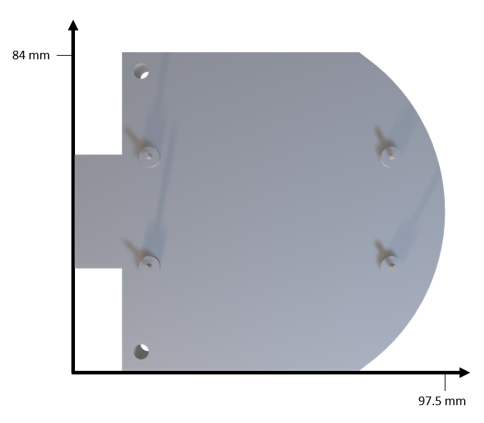 | 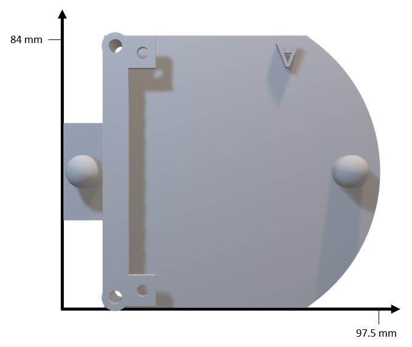 |

#### [Motor layer](3D_Printing/stl/MotorLayer1.stl)

|                          Top                           |                          Bottom                           |
| :----------------------------------------------------: | :-------------------------------------------------------: |
| 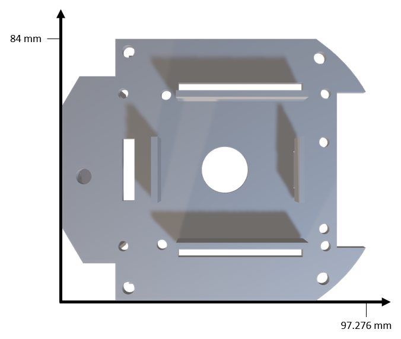 | 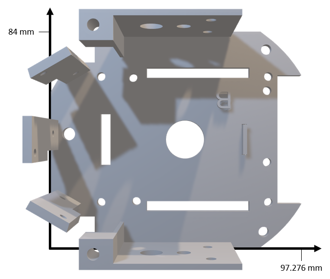 |

#### [Arduino layer](3D_Printing/stl/ArduinoLayer.stl)

|                          Top                          |                           Bottom                            |
| :---------------------------------------------------: | :---------------------------------------------------------: |
| 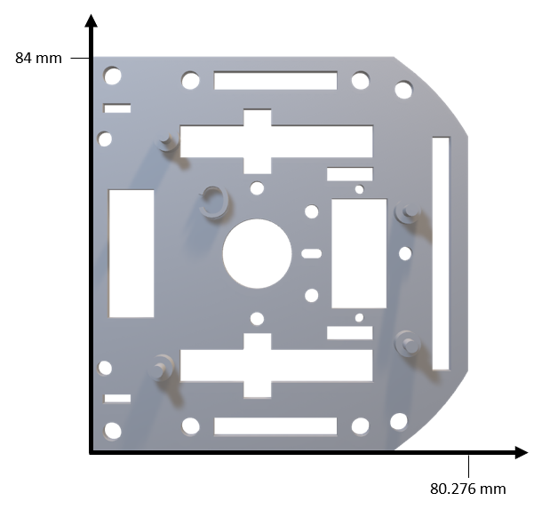 | 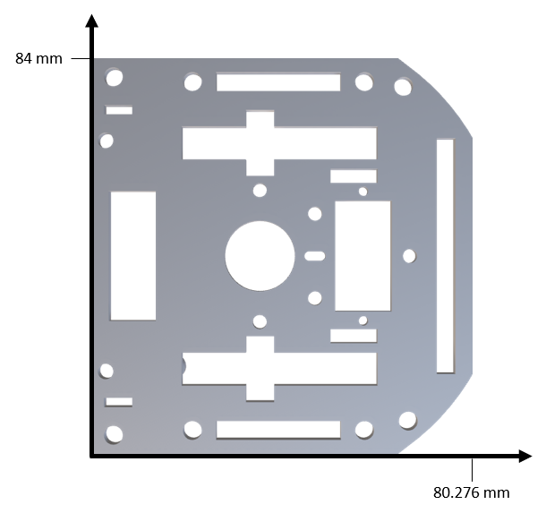 |

#### [Additional Layer](3D_Printing/stl/Layer.stl)

|                      Top                       |                        Bottom                        |
| :--------------------------------------------: | :--------------------------------------------------: |
| 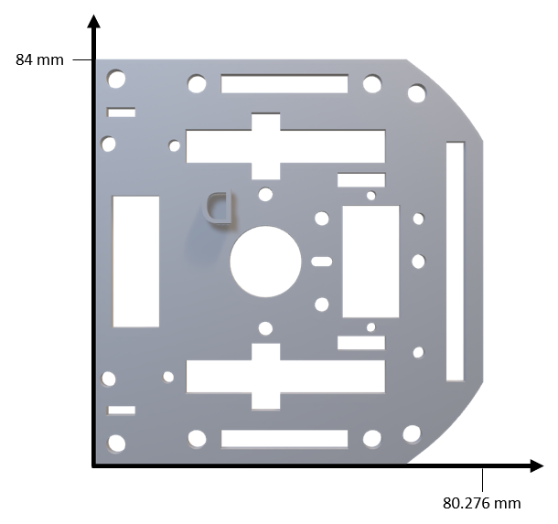 | 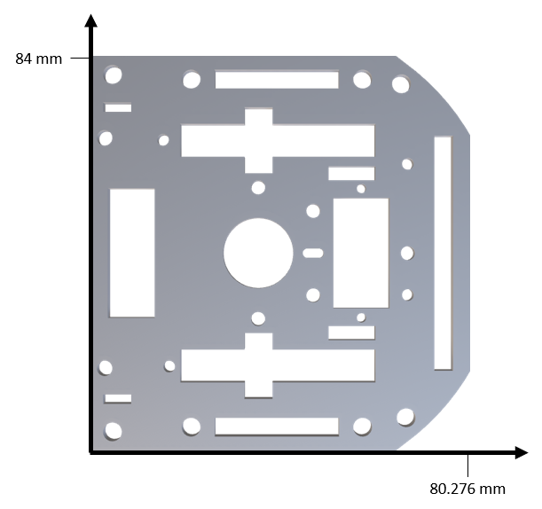 |

#### [Wheels](3D_Printing/stl/rims.stl)

|                      Rims                      |                     Tires                      |
| :--------------------------------------------: | :--------------------------------------------: |
| 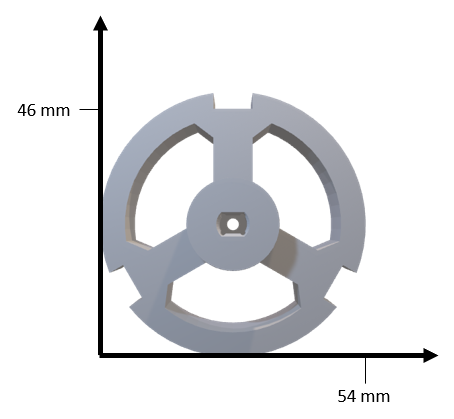 | 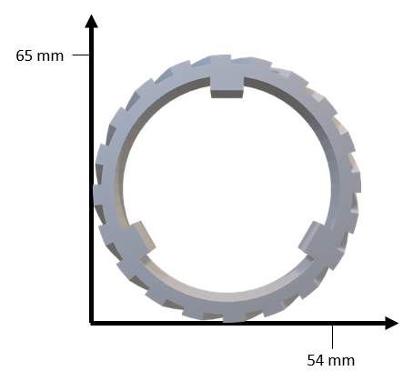 |

### Printed Circuit Board (PCB)

|                                                   |                                               |
| :-----------------------------------------------: | :-------------------------------------------: |
| 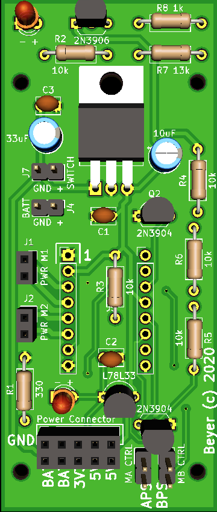 |  |

### [Motor](https://www.adafruit.com/product/3777)

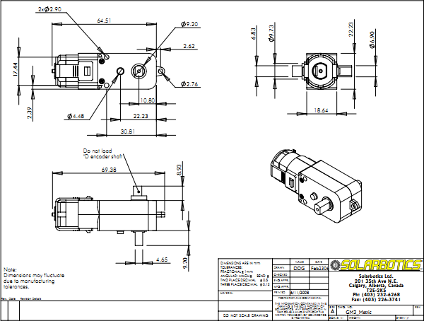

### [Sharp GP2Y0A51SK0F Analog Distance Sensor 2-15 cm](https://www.pololu.com/product/2450)

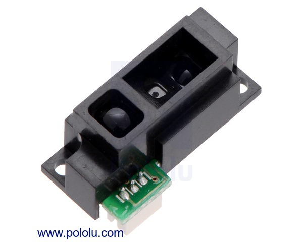

### [QTR-8RC Reflectance Sensor Array](https://www.pololu.com/product/961)

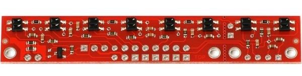